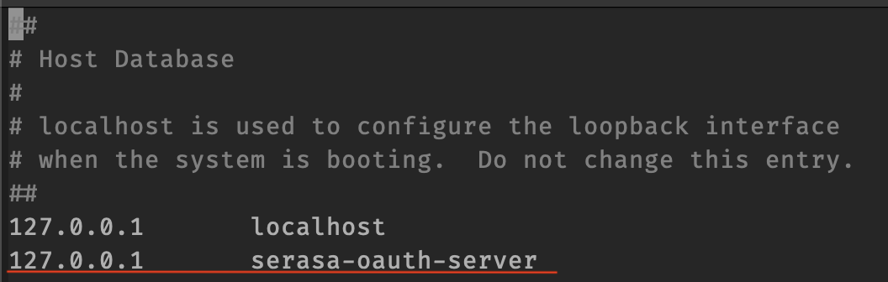
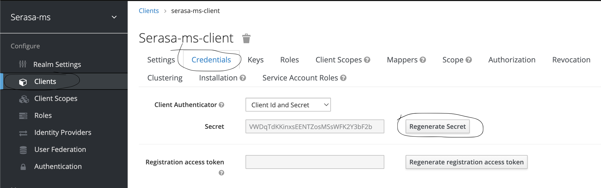
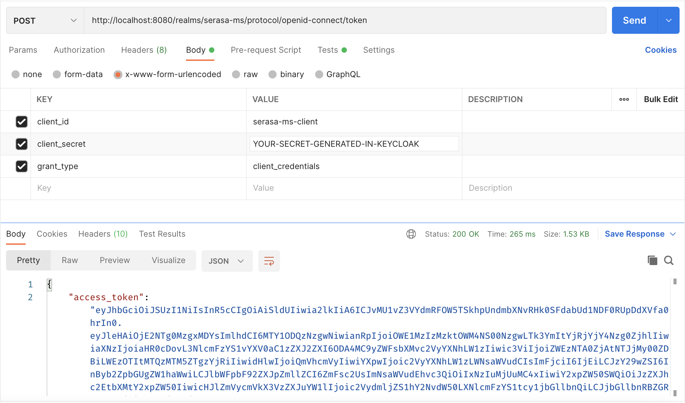

serasa-ms
=========

Technologies:
- Docker (Run apps in container LXC)
- Docker Compose (Docker Automator)
- Java 18 (Programming Language)
- PostgreSQL 14 (SGBD)
- Maven (Buld Tool)
- JUnit and Mockito (Unit tests and mock)
- Swagger 3 (Open API Documentation)
- Keycloak (OAuth 2.0 Identity Provider)
- PostgreSQL (Database)
- Flywaydb (Migrations)
- Hexagonal Architecture Pattern

Swagger:
--------

- Swagger UI: http://localhost:8090/serasa-ms/swagger-ui/index.html
- API Docs V2: http://localhost:8090/serasa-ms/v2/api-docs
- API Docs V3:http://localhost:8090/serasa-ms/v3/api-docs
- Open API Docs: http://localhost:8090/serasa-ms/serasa-ms-openapi

Keycloak Admin:
---------------
- URL: http://serasa-oauth-server:8080/admin/master/console/#/realms/serasa-ms
- Username: admin
- Password: Pa55w0rd

Note: To access keycloak admin, configure /etc/hosts in your machine:

Sign in (with admin user) and generate client_secret to access resources:

To Get Token (JWT) use url bellow:
- URL: http://localhost:8080/realms/serasa-ms/protocol/openid-connect/token

